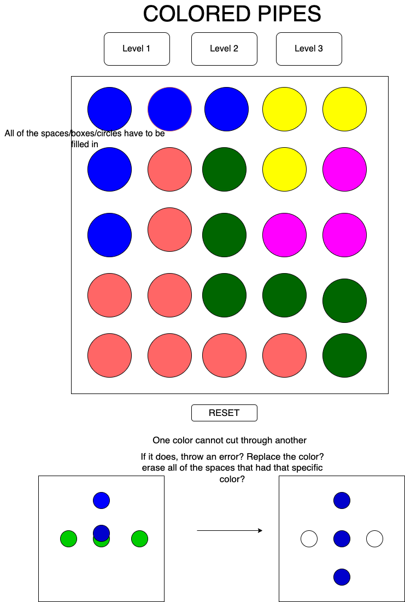
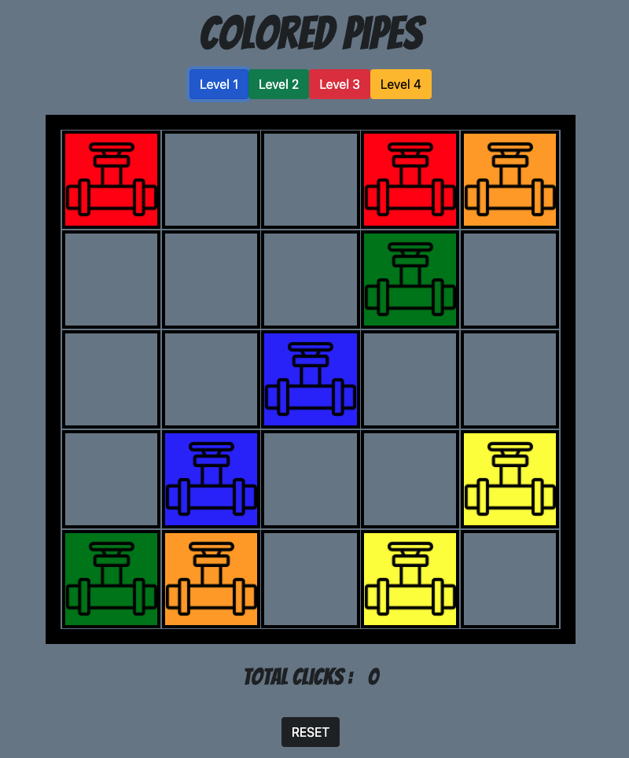

# **Color Pipes**

## **How The Game Works:**
**TLDR: Connect the colored pipes**

This is a game in which the player needs to connect the pipes by matching one end of the pipe to another. The initial/end pipe locations have already been designated. 

When a player clicks (and holds down) on the initial colored pipe and drags their mouse, it will create a colored path of the same color.

It is the player's task to connect the color pipes accordingly without intersecting any of the others. Creating a new pipe through a previously created one will erase/overwrite that previously drawn pipe.

In order to win, the player needs to color in every space on the grid and all of the pre-set starting pipes need to be connected by their respective colors.

## **Wireframe / Planning Process**


## **Screenshot of Completed Game**


## **Tech Being Used**
- HTML
- CSS
- JavaScript
- Bootstrap

## **MVP Checklist**
- [x] A functional working game board that adjusts to the window size.
- [x] Clicking and holding on the starting pipe will select that color and paint the created path with that held color
- [x] Colors change appropriately when selecting a different colored pipe
- [x] Intersecting a previously drawn pipe will cause that previous pipe to be replaced
- [x] Clicking on the same color for the second time will delete a previously drawn pipe of that respective color if it exists. 
- [x] Clicking a color for the second time will also prevent you from creating a pipe of that color. This is to prevent the ability create multiple pipe paths of the same color. The internal click counter will then be reset once you let go of the second click, allowing a pipe to be created again.
- [x] Game recognizes when the winning condition occurs/puzzle completed (all pipes are connected accordingly and all spaces on the board are colored)
- [x] Clicking on the different level buttons changes the board layout/placement of starting pipes
- [x] There is no losing condition but there is a reset button to clear the drawn pipes and bring the click counter back to 0

## **Stretch Goals**
- [x] Add number of turns taken
- [x] Add additional levels
- [ ] larger boards with additional numbers of colors per board
- [ ] Throw in random barriers (ie. rocks)

## **Code Highlights**
```javascript
const createPipesThenListen = () => {
    const playingField = document.querySelector(".playing-field");
    playingField.innerText = "";
    for (let i = 1; i < 26; i++) {
        pipeSpace = document.createElement("div");
        pipeSpace.classList.add("pipes");
        pipeSpace.setAttribute("id", "pipe" + i);
        pipeSpace.setAttribute("draggable", true);
        pipeSpace.style.backgroundColor = "slategray";
        playingField.appendChild(pipeSpace);
        pipeSpace.addEventListener("mousedown", calculateClicksThenListen);
    }
};
```
```javascript
    const allPipes = document.querySelectorAll(".pipes");
    const arrayOfAllPipes = Array.from(allPipes);
    for (let i = 0; i < arrayOfAllPipes.length; i++) {
        arrayOfAllPipes[i].addEventListener("dragenter", fillInColor);
    }
};
```

## **Resources**
- https://www.w3schools.com/jsref/event_onmousedown.asp
- https://www.w3schools.com/howto/howto_js_draggable.asp
- https://developer.mozilla.org/en-US/docs/Web/API/Document/dragenter_event